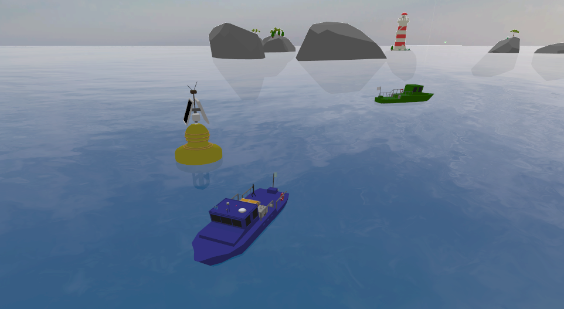

# Aqua.Bot 2023



## About

Aqua.Bot is a challenge organized by Sirehna (Naval Group) aimed at developing a program capable of controlling an Unmanned Surface Vehicle (USV) tasked with monitoring a maritime zone and relaying the positions of intruding vessels.

The competition spanned 2 months, during which we developed two key modules:

### Navigation
The navigation module enables autonomous control of the drone within its environment. The initial objective involves reaching the buoy that delineates the search area where the threat is located. Subsequently, it demonstrates the capability to maneuver the surface drone while effectively tracking the identified threat.

https://github.com/EthanDelage/aquabot/assets/50496792/67a0170c-d944-461a-99a4-69b9b991643f


### Perception
The perception module is designed to detect threats utilizing the camera and estimate their distance using lidar sensor. Threat recognition is achieved through color detection, while distance estimation involves projecting the lidar's 3D points onto the camera rendering. By leveraging the threat's distance and angle, the module can calculate its GPS position.

https://github.com/EthanDelage/aquabot/assets/50496792/6377734d-59ac-47a8-b206-32733cc76101

For additional details, please refer to the report available:

- [PDF report](assets/report.pdf)
- [PowerPoint presentation](assets/presentation.pptx)

## Usage

### Dependencies

- OpenCV 4.8.1
- Eigen3
- C++ 17
- Ros Humble
- Gazebo Garden

### Installation

- Install [ROS 2 Humble](https://docs.ros.org/en/humble/Installation/Ubuntu-Install-Debians.html)
- Install [Gazebo Garden](https://gazebosim.org/docs/garden/install_ubuntu)

### Source Ros

```shell
source /opt/ros/humble/setup.sh
```

### Build

```shell
make build
. install/setup.sh
```

### Run

```shell
make launch
```

## Acknowledgments

Following two months of dedicated research and hard work, we are proud to announce that we earned **second place** in the competition!
We would like to thank Sirehna and Naval Group for organizing the competition and supporting us. 
